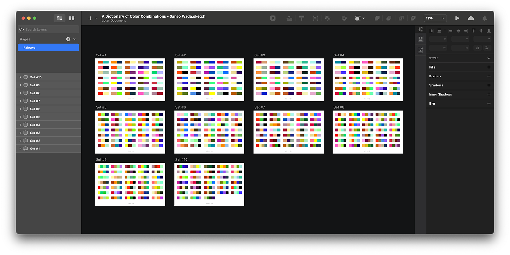

# Sanzo Wada's Color Combinations in Sketch

**A Dictionary of Color Combinations** is a book of sample color combinations created by the Japanese artist Sanzo Wada in 1918.

The book provides sample color combinations for art students and professionals to use. It has been credited with being the first book to catalog color schemes in such a manner and has been compared to modern graphic design resources.

[HexPot](https://hexpot.com/) put together all 348 color combinations converted from CMYK to HEX in a Sketch file. It is a great copilot for the original book, which we highly recommend to have in your library.

[Download Sketch File](https://github.com/hexpotcom/sanzo-wada/raw/main/A%20Dictionary%20of%20Color%20Combinations%20-%20Sanzo%20Wada.sketch)

